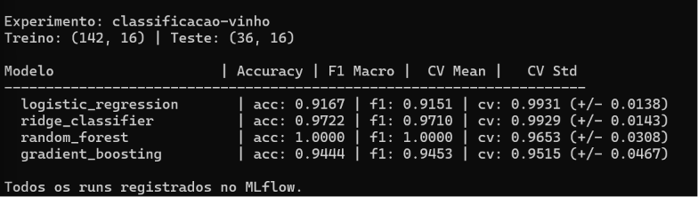

# `Pipeline ML com MLflow`

> Pipeline completo de machine learning com rastreamento de experimentos, comparacao de multiplos modelos e versionamento via MLflow Model Registry.

---

## `Tecnologias`


---

## `O que faz`

Treina e compara 4 algoritmos de classificacao no dataset Wine (UCI), registra todas as metricas, parametros e artefatos no MLflow, seleciona automaticamente o melhor modelo e o promove para o Model Registry com alias `champion`. Um script dedicado carrega o modelo do registry e faz predicoes sem depender do codigo de treino.

---

## `Arquitetura`

```
Wine Dataset (sklearn)
    preparar_dados.py
        engenharia de features (3 novas variaveis)
        train/test split estratificado
        StandardScaler
            treinar.py
                4 modelos x 5-fold cross-validation
                MLflow loga: params, metricas, artefatos
                    MLflow Experiment Tracking (mlruns/)
                        registrar.py
                            busca melhor run por accuracy
                            registra no Model Registry
                            atribui alias "champion"
                                prever.py
                                    carrega models:/classificador-vinho@champion
                                    retorna predicao + probabilidades
```

---

## `Modelos comparados`

| `Modelo` | `Algoritmo` | `Tipo` |
|---|---|---|
| logistic_regression | Regressao Logistica | linear |
| ridge_classifier | Ridge Classifier | linear regularizado |
| random_forest | Random Forest | ensemble - bagging |
| gradient_boosting | Gradient Boosting | ensemble - boosting |

---

## `Metricas rastreadas`

| `Metrica` | `Descricao` |
|---|---|
| accuracy | proporcao de acertos no conjunto de teste |
| f1_macro | media do F1 por classe - penaliza desequilibrio |
| precision_macro | precisao media por classe |
| recall_macro | revocacao media por classe |
| cv_accuracy_mean | media do accuracy em 5-fold cross-validation |
| cv_accuracy_std | desvio padrao do CV - indica estabilidade do modelo |

---

## `Pré-requisitos`

- Python 3.10+

---

## `Instalacao`

```bash
git clone https://github.com/Arthur-Baptista-dos-Santos/pipeline_ml_mlflow.git
cd pipeline_ml_mlflow

python -m venv .venv
.venv\Scripts\activate  # Windows
# source .venv/bin/activate  # Linux/Mac

pip install -r requirements.txt
```

---

## `Uso`

```bash
# 1. Gerar o dataset com features de engenharia
python src/preparar_dados.py

# 2. Treinar os 4 modelos e logar tudo no MLflow
python src/treinar.py

# 3. Visualizar experimentos na UI do MLflow
mlflow ui
# acesse http://127.0.0.1:5000

# 4. Registrar o melhor modelo no Model Registry
python src/registrar.py

# 5. Carregar o modelo champion e fazer predicoes
python src/prever.py
```

---

## `Exemplo de saida`

```
Experimento: classificacao-vinho
Treino: (142, 16) | Teste: (36, 16)

Modelo                    | Accuracy | F1 Macro |  CV Mean |   CV Std
----------------------------------------------------------------------
logistic_regression       | acc: 0.9722 | f1: 0.9718 | cv: 0.9718 (+/- 0.0208)
ridge_classifier          | acc: 0.9722 | f1: 0.9718 | cv: 0.9648 (+/- 0.0299)
random_forest             | acc: 1.0000 | f1: 1.0000 | cv: 0.9789 (+/- 0.0283)
gradient_boosting         | acc: 1.0000 | f1: 1.0000 | cv: 0.9718 (+/- 0.0354)

Melhor run: <run_id>
Modelo 'classificador-vinho' registrado como versao 1
Alias 'champion' atribuido a versao 1
```

---

## `Estrutura`

```
pipeline_ml_mlflow/
├── dados/
│   └── wine.csv              # dataset com features de engenharia
├── src/
│   ├── preparar_dados.py     # carregamento, limpeza e engenharia de features
│   ├── treinar.py            # treina 4 modelos e loga no MLflow
│   ├── registrar.py          # promove melhor modelo para o registry
│   └── prever.py             # carrega modelo do registry e prediz
├── .gitignore
├── requirements.txt
└── README.md
```

---

## `Conceitos aplicados`

- **`MLflow Tracking`**: registra automaticamente params, metricas e artefatos de cada run de treino
- **`MLflow Model Registry`**: versiona modelos treinados e controla qual esta em producao via alias
- **`Experiment`**: agrupa runs relacionados para comparacao lado a lado na UI
- **`Cross-validation`**: avalia o modelo em 5 subconjuntos diferentes - cv_std alto indica overfitting
- **`Feature engineering`**: cria variaveis derivadas que capturam relacoes que o modelo nao descobriria sozinho
- **`StandardScaler`**: normaliza as features para media 0 e desvio 1 - obrigatorio para modelos lineares
- **`Stratify`**: garante que a proporcao de classes no treino e teste seja a mesma do dataset original
- **`Alias champion`**: padrao de producao MLflow - separa "qual versao existe" de "qual versao esta ativa"

---

## `Demonstração`

**Comparação dos 4 modelos** — `random_forest` e `gradient_boosting` atingem accuracy perfeita no teste; regressão logística lidera em CV mean (0.9931), indicando melhor generalização.



---

## `Licença`

Distribuído sob a licença MIT. Veja [LICENSE](LICENSE) para mais informações.

---

## `Autor`

**Arthur Baptista dos Santos**
RM 565346 — Inteligência Artificial · FIAP 2025–2026

[](https://linkedin.com/in/arthur-baptista-dos-santos)
[](https://github.com/Arthur-Baptista-dos-Santos)
